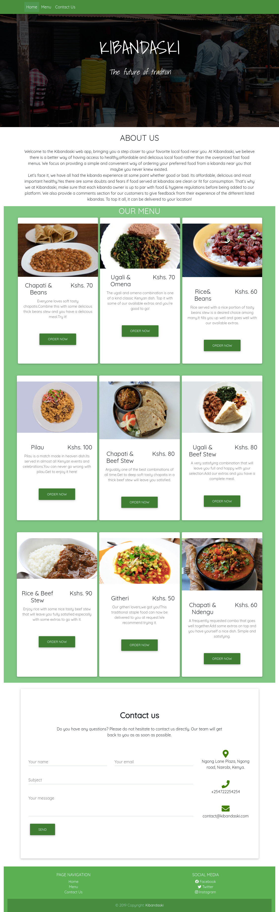

# Kibandaski
#### Food ordering website, 01/08/2019
## Description
This is a project that contains a website for ordering from a kibanda and then it will be delivered to the address they provide.

## Screenshot

## Deployment
https://josylad.github.io/kibandaski

## Set-up and installation
* Fork the project
* Clone to your local directory
* Open the html file
* Launch it in your browser
## Known Bugs
No known bugs at the moment.
## Technologies used
* HTML
* CSS
* Java Script and JQuery
## Authors
Marcus Jean-Louis
Daisy Arusey
Naomi Neema
Chris Mwenda
Arnold Kibira
Joseph Adediji
## License
This project is licensed under the MIT License - see the [LICENSE.text](LICENSE.text) file for details
Copyright (c) 2019
